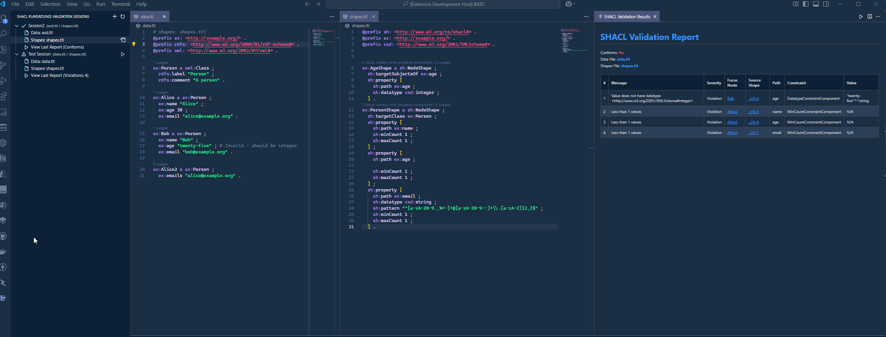

<!-- filepath: d:\Projects\Misc\SHACL-vscode\shacl-validator-gemini\README.md -->
# VSCode SHACL Validator

A Visual Studio Code extension for validating RDF data against SHACL shapes, with advanced features for a seamless development experience.

## Overview

The **VSCode SHACL Validator** extension integrates SHACL validation directly into your VS Code environment. It allows you to validate your RDF documents (e.g., Turtle, JSON-LD) against SHACL shape definitions, view validation reports, manage validation sessions, and more.

## Features

* **SHACL Validation**:
  * Validate the active RDF document.
  * Validate specific RDF files from the explorer.
  * View detailed validation reports within VS Code.
* **Session Management**:
  * Create and manage multiple validation sessions.
  * Each session can have its own data and shapes files.
  * Run validation for specific sessions.
  * View, rename, and delete sessions.
  * Easily open files associated with a session.
* **Highlighting**:
  * Highlight specific selections in your RDF files.
  * Clear highlights.
  * Highlight focus nodes from SHACL validation reports.
  * Configurable highlight color.
* **CodeLens for Turtle Files**:
  * Provides CodeLens actions directly in your SHACL (Turtle) files.
  * Quickly select a data document to validate against the current shapes file.
  * Highlight focus nodes identified in the shapes file within a selected data document.
* **Language Support**:
  * Provides basic language support for Turtle (`.ttl` files) files.
* **Activity Bar View**:
  * A dedicated view in the activity bar for managing SHACL validation sessions.

## Screenshots

## Commands

The extension provides the following commands, accessible via the Command Palette (`Ctrl+Shift+P` or `Cmd+Shift+P`):

**SHACL Validation & Sessions:**

* `SHACL: Validate Active Document`: Validates the currently open and active RDF document.
* `SHACL: Validate File...`: Prompts to select an RDF file to validate.
* `SHACL: Create New Validation Session`: Creates a new session for managing SHACL validation with specific data and shapes files.
* `SHACL: Run Validation`: Runs the validation for a selected session (available from the session view).
* `SHACL: View Last Report`: Opens the last validation report for a selected session (available from the session view).
* `SHACL: Delete Session`: Deletes a selected validation session (available from the session view).
* `SHACL: Rename Session`: Renames a selected validation session (available from the session view).
* `SHACL: Open File`: Opens a file associated with a session (e.g., data or shapes file, available from the session view).
* `SHACL: Refresh Sessions`: Refreshes the list of validation sessions in the activity bar view.
* `SHACL: Highlight Focus Nodes`: Highlights focus nodes from a validation report in the relevant data document.
* `SHACL: Select Data Document for Focus Nodes`: (Used by CodeLens) Prompts to select a data document to find and highlight focus nodes defined in a SHACL shapes file.

**Highlighting:**

* `Highlight: Highlight Current Selection`: Highlights the currently selected text in the editor.
* `Highlight: Clear All Highlights`: Clears all active highlights made by this extension.

## Configuration

The following settings can be configured in your VS Code settings (`settings.json`):

* `shaclValidator.highlighting.color`:
  * Description: The background color for text highlights. Use a valid CSS color (e.g., `'#FFFF00'`, `'rgba(255,255,0,0.3)'`). Set to `null` to use VS Code's default selection highlight color.
* `shaclValidator.enableCodeLens`:
  * Description: Enables or disables CodeLens for SHACL features in Turtle files. (Assumed based on `ShaclCodeLensProvider` and typical extension patterns, verify actual property name if different).

## Getting Started

1. **Install the Extension**: Search for "vscode-shacl-validator" in the VS Code Extensions view and click Install.
2. **Open your RDF and SHACL files**: The extension primarily works with Turtle (`.ttl`, `.shc`) and JSON-LD (`.jsonld`) files.
3. **Using Commands**:
   * Open the Command Palette (`Ctrl+Shift+P` or `Cmd+Shift+P`).
   * Type "SHACL:" to see the list of available validation and session management commands.
   * Type "Highlight:" to see highlighting commands.
4. **Managing Sessions**:
   * Use the "SHACL Playground" view in the Activity Bar (you might need to enable it if it's not visible).
   * Click the "+" icon in the view title bar or run the `SHACL: Create New Validation Session` command.
   * You'll be prompted to select a data file and a shapes file for the session.
   * Once a session is created, you can run validation, view reports, and manage files directly from the tree view item context menu.
5. **Using CodeLens (for `.ttl`/`.shc` SHACL files)**:
   * Open a SHACL file (e.g., `shapes.ttl`).
   * Above shape definitions, you should see CodeLens prompts like "Select Data Document & Highlight Focus Nodes".
   * Clicking this will allow you to choose a data document. The extension will then attempt to find and highlight the focus nodes (subjects of your shapes) in that data document.

## Release Notes

See the [CHANGELOG.md](CHANGELOG.md) file for details on notable changes in each version.

## License

MIT License. See the [LICENSE](LICENSE) file for details.
